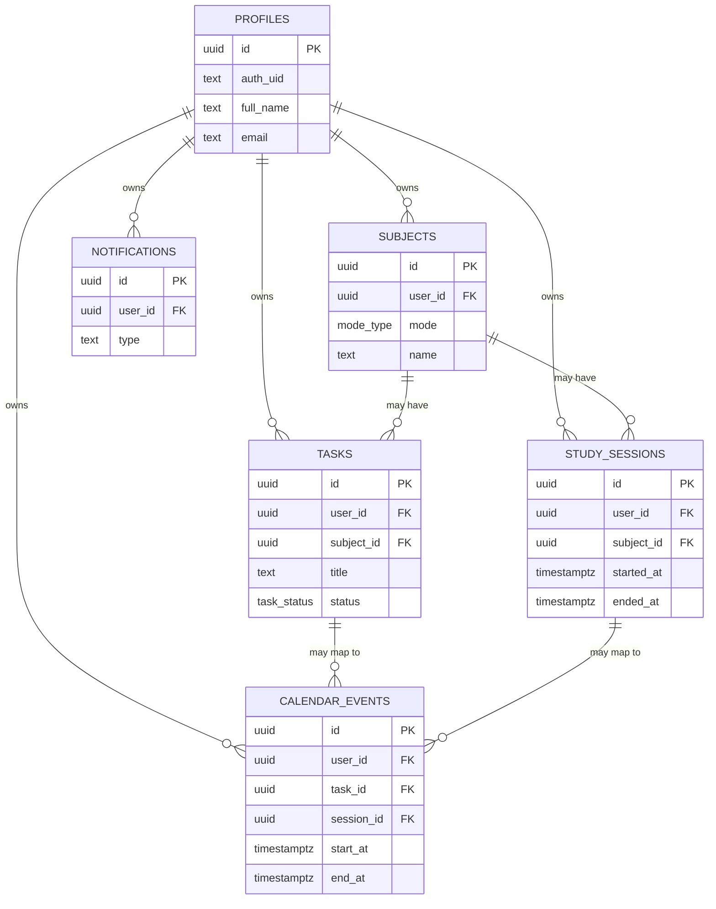

# Diagrama ER — StudySync (Sprint 08)

```mermaid
erDiagram
    PROFILES {
        uuid id PK
        text auth_uid
        text full_name
        text email
    }
    SUBJECTS {
        uuid id PK
        uuid user_id FK
        mode_type mode
        text name
    }
    TASKS {
        uuid id PK
        uuid user_id FK
        uuid subject_id FK
        text title
        task_status status
    }
    STUDY_SESSIONS {
        uuid id PK
        uuid user_id FK
        uuid subject_id FK
        timestamptz started_at
        timestamptz ended_at
    }
    CALENDAR_EVENTS {
        uuid id PK
        uuid user_id FK
        uuid task_id FK
        uuid session_id FK
        timestamptz start_at
        timestamptz end_at
    }
    NOTIFICATIONS {
        uuid id PK
        uuid user_id FK
        text type
    }

    PROFILES ||--o{ SUBJECTS : owns
    PROFILES ||--o{ TASKS : owns
    PROFILES ||--o{ STUDY_SESSIONS : owns
    PROFILES ||--o{ CALENDAR_EVENTS : owns
    PROFILES ||--o{ NOTIFICATIONS : owns

    SUBJECTS ||--o{ TASKS : "may have"
    SUBJECTS ||--o{ STUDY_SESSIONS : "may have"
    TASKS ||--o{ CALENDAR_EVENTS : "may map to"
    STUDY_SESSIONS ||--o{ CALENDAR_EVENTS : "may map to"
```

> Abra este arquivo em qualquer visualizador Markdown que suporte Mermaid para ver o diagrama visual.
